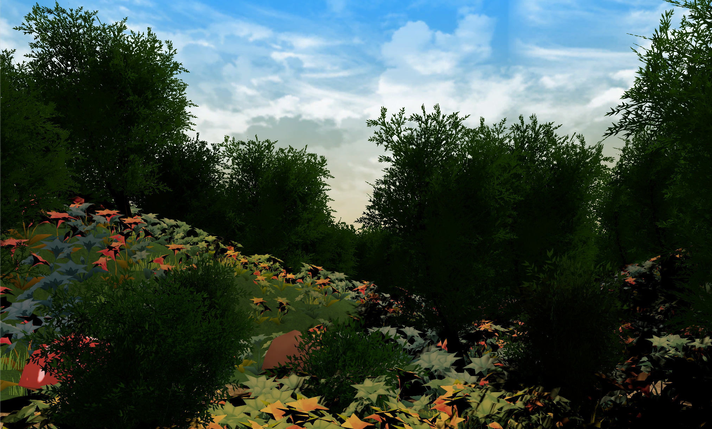

<!-- Markdown link & img definitions -->
[npm-image]: https://img.shields.io/npm/v/datadog-metrics.svg?style=flat-square
[npm-url]: https://npmjs.org/package/datadog-metrics
[npm-downloads]: https://img.shields.io/npm/dm/datadog-metrics.svg?style=flat-square
[travis-image]: https://img.shields.io/travis/dbader/node-datadog-metrics/master.svg?style=flat-square
[travis-url]: https://travis-ci.org/dbader/node-datadog-metrics
[wiki]: https://github.com/yourname/yourproject/wiki
[placeholder-image]: http://via.placeholder.com/700x400
<!-- End markdown link & img definitions -->

# Fractal Forest
Version 1.0  
[![NPM Version][npm-image]][npm-url]
[![Build Status][travis-image]][travis-url]
[![Downloads Stats][npm-downloads]][npm-url]

## Introduction
Our VR project goal was to give the user a calming, fun experience with fractal designs and music interaction with nature.

## Getting Started

### Prerequisites
Describe what the environment/system requirements are
* Windows or Mac
* Unity 2017.2

### Installation steps
1. Pull down repo
2. Open up project in Unity
3. Open up the FractalForest scene
4. Play using an HTC Vive or another VR headset

## Usage
> Use the scene in the FractalForest folder

#### Additional notes
This section is optional. Can be used to give any other tips and tricks.

## Contributing
1. Fork it (<https://github.com/yourname/yourproject/fork>)
2. Create your feature branch (`git checkout -b feature/fooBar`)
3. Commit your changes (`git commit -am 'Add some fooBar'`)
4. Push to the branch (`git push origin feature/fooBar`)
5. Create a new Pull Request

## Authors
* Jessie Albarian
* Sophie Brande
* Juan Vargas-Murillo
* Guadalupe Avalos

## License
This project is licensed under the MIT License - see the [LICENSE.md](LICENSE.md) file for details

## Acknowledgments

* [Nature Starter Kit 2](https://www.assetstore.unity3d.com/en/#!/content/52977)
* [Toon Forest](https://www.assetstore.unity3d.com/en/#!/content/66124)
